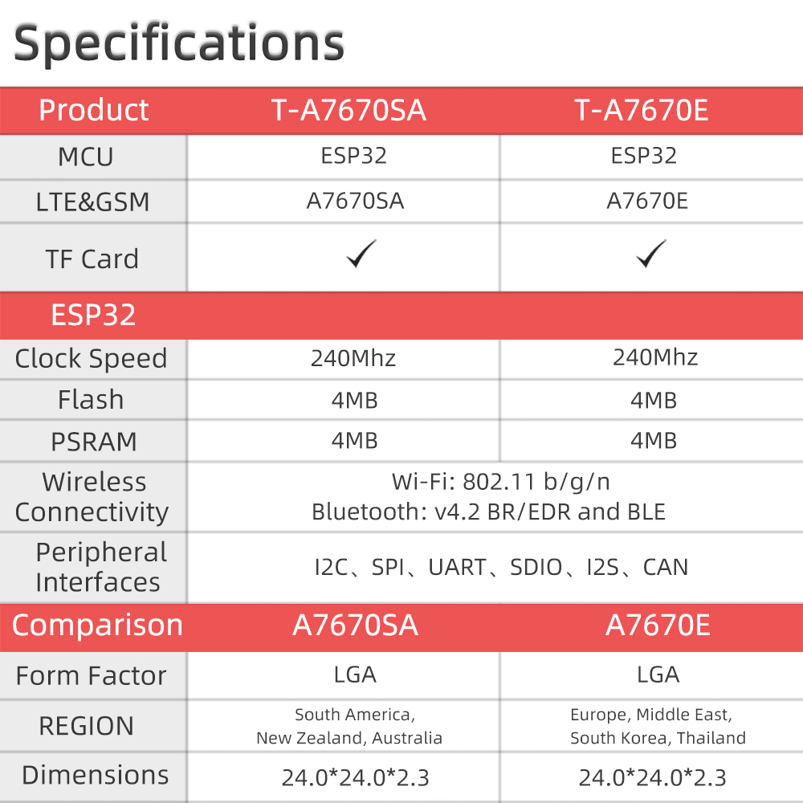
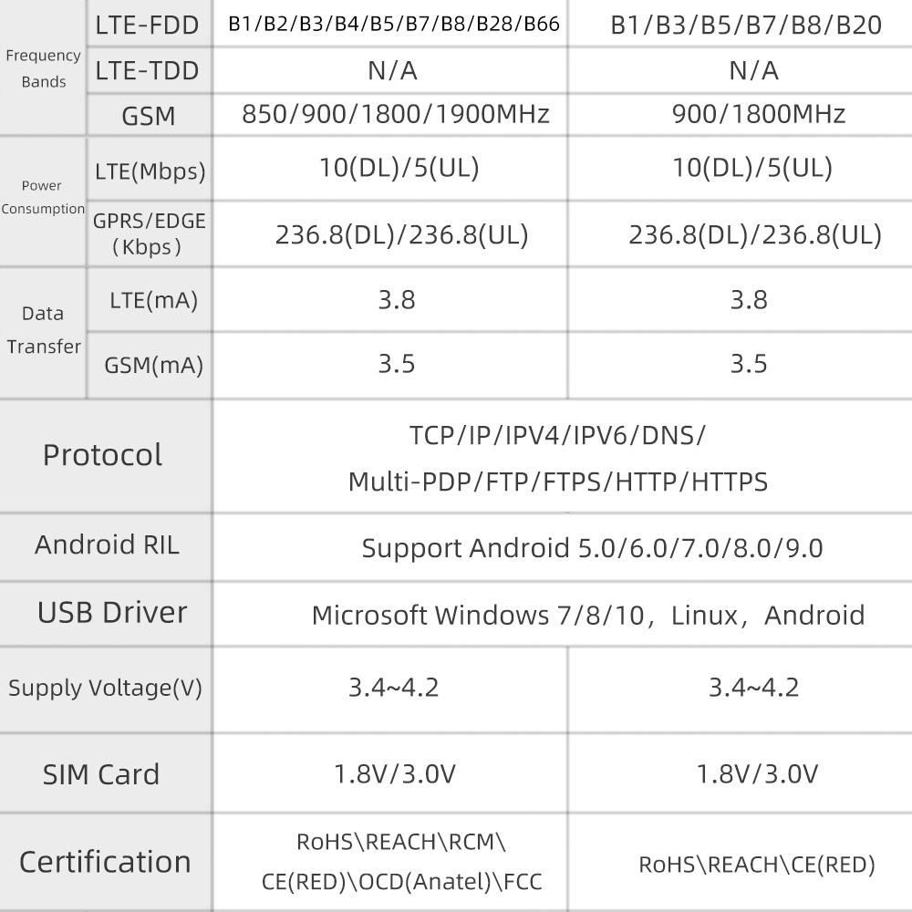
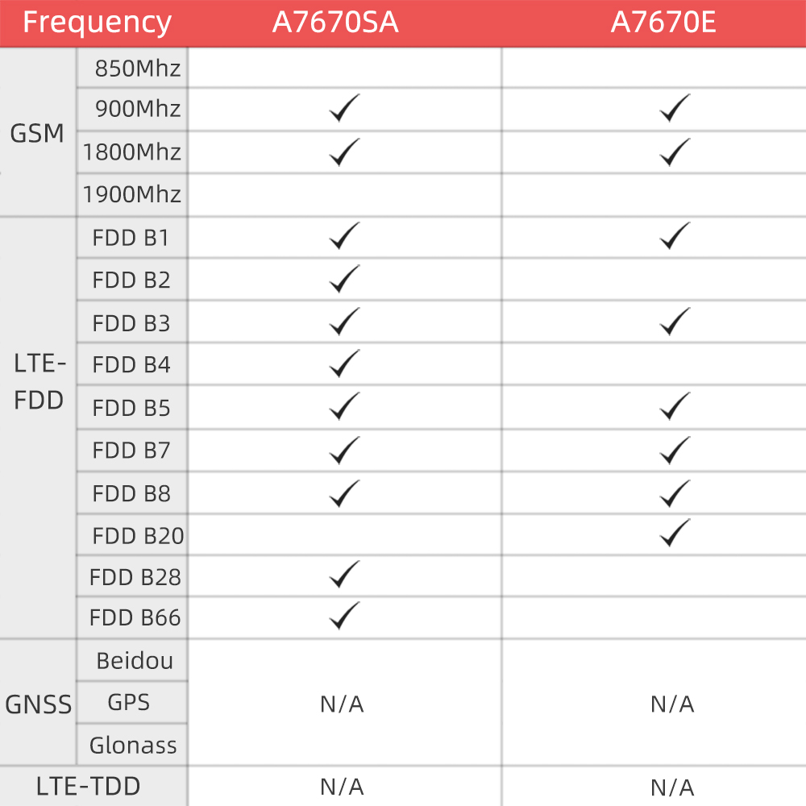

<h1 align = "center">🌟LilyGo T-A7670X🌟</h1>

## **English | [中文](docs/docs_cn.md)**

<h2 align = "left">Product 📷:</h2>

| Product  | Product  Link |
| :------: | :-----------: |
| T-A7670X |   updateing   |

## Notes for new Users

1. pin VIN is a USB input, if a battery is being used to power the device there will be no voltage output from VIN meaning 3.3v is the only power output.

2. When using the built-in battery pack the on/off switch will function as normal, supplying/cutting off power to the board, However, if an external battery pack is used and attached to the VBAT pin the on/off switch will be bypassed meaning the only way to shut off will be to disconnect the batteries.

3. On/off switch is for battery use only, it will not function when plugged into USB.

4. Battery voltage can not be read when plugged into USB using the onboard BAT ADC(35) 

5. Recommended solar panels are 4.4v to 6v **DO NOT EXCEED OR BOARD MAY BE DAMAGED** 

6. When an SD card in you can not upload software in Arduino IDE since the SD card uses IO2 as CS, the SD card must be removed when uploading a new sketch. 

