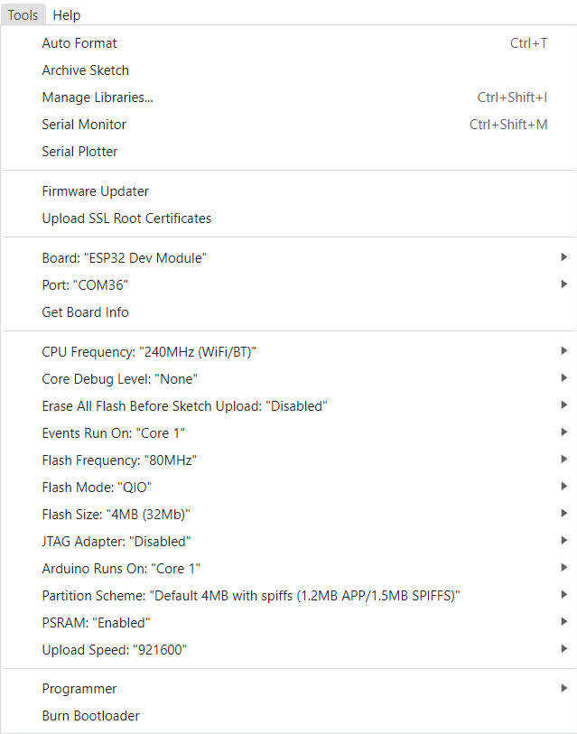

<h1 align = "center">🌟LilyGo T-A7670X🌟</h1>

# News

- The TinyGSM used in the example is a [fork](https://github.com/lewisxhe/TinyGSM) to support A7670 and SIM7672,If you use the master branch, the compilation will not go smoothly

# 1️⃣Product

| Product(PinMap)    | SOC            | Flash | PSRAM     | Schematic                                      |
| ------------------ | -------------- | ----- | --------- | ---------------------------------------------- |
| [T-A7670X][1]      | ESP32-WROVER-E | 4MB   | 8MB(QSPI) | [schematic](./schematic/T-A7670X_V1.1.pdf)     |
| [T-Call-A7670X][2] | ESP32-WROVER-E | 4MB   | 8MB(QSPI) | [schematic](./schematic/T-Call-A7670_V1.0.pdf) |

[1]: https://www.lilygo.cc/products/t-sim-a7670e
[2]: https://www.lilygo.cc

## 2️⃣Examples

| Example        | [T-A7670X][1]     | [T-Call-A7670X][1] | [T-SIM7672G][1] |
| -------------- | ----------------- | ------------------ | --------------- |
| ATdebug        | ✅                 | ✅                  | ✅               |
| Blynk_Console  | ✅                 | ✅                  |                 |
| GPSShield      | ✅ (Just T-A7670G) | ❌   (Can't run)    | ❌   (Can't run) |
| GPS_BuiltIn    | ✅                 | ✅                  | ✅                |
| GPS_NMEA_Parse | ✅                 | ✅                  | ✅                |
| HttpClient     | ✅                 | ✅                  | ✅                |
| HttpsClient    | ✅                 | ✅                  | ✅                |
| MqttClient     | ✅                 | ✅                  | ✅                |
| ReadBattery    | ✅                 | ❌   (Can't run)    | ✅                |
| Sleep          | ✅                 | ✅                  | ✅               |
| Voice_Call     | ✅                 | ✅                  | ✅                |
| SDCard         | ✅                 | ❌   (Can't run)    | ✅               |

# Quick start ⚡

## 3️⃣ PlatformIO Quick Start (Recommended)

1. Install [Visual Studio Code](https://code.visualstudio.com/) and [Python](https://www.python.org/)
2. Search for the `PlatformIO` plugin in the `VisualStudioCode` extension and install it.
3. After the installation is complete, you need to restart `VisualStudioCode`
4. After restarting `VisualStudioCode`, select `File` in the upper left corner of `VisualStudioCode` -> `Open Folder` -> select the `LilyGO-T-A7670X` directory
5. Wait for the installation of third-party dependent libraries to complete
6. Click on the `platformio.ini` file, and in the `platformio` column
7. Select the board name you want to use in `default_envs` and uncomment it.
8. Uncomment one of the lines `src_dir = xxxx` to make sure only one line works
9. Click the (✔) symbol in the lower left corner to compile
10. Connect the board to the computer USB
11. Click (→) to upload firmware
12. Click (plug symbol) to monitor serial output
13. If it cannot be written, or the USB device keeps flashing, please check the **FAQ** below

## 4️⃣ Arduino IDE Quick Start

* It is recommended to use platformio without cumbersome steps

1. Install [Arduino IDE](https://www.arduino.cc/en/software)
2. Install [Arduino ESP32 2.0.5 or above](https://docs.espressif.com/projects/arduino-esp32/en/latest/) 
3. Copy all folders in [lib folder](./lib/)  to Arduino library folder (e.g. C:\Users\YourName\Documents\Arduino\libraries)
4. Open ArduinoIDE  ,`Tools` , Look at the picture to choose
   <!--  -->
   | Setting                              | Value                                                          |
   | :----------------------------------- | :------------------------------------------------------------- |
   | Board                                | ESP32 Dev Module                                               |
   | CPU Frequency                        | 240MHz                                                         |
   | Core Debug Level                     | None                                                           |
   | Erase All Flash Before Sketch Upload | Disabled                                                       |
   | Events Run On                        | Core 1                                                         |
   | Flash Frequency                      | 80MHz                                                          |
   | Flash Mode                           | QIO                                                            |
   | Flash Size                           | 4MB (32Mb)  (Unchangeable)                                     |
   | JTAG Adapter                         | Disabled                                                       |
   | Arduino Runs On                      | Core 1                                                         |
   | Partition Scheme                     | Default 4MB  with spiffs(1.2MB APP/1.5MB SPIFFS)(Unchangeable) |
   | PSRAM                                | Enabled                                                        |
   | Upload Speed                         | 921600                                                         |
5. `LilyGO-T-A7670X` folder -> `examples`
6. For runnable examples, please refer to the example list above.
7. Open the corresponding board macro definition above <utilities.h>
8. Select `Port`
9. Click `upload` , Wait for compilation and writing to complete
10. If it cannot be written, or the USB device keeps flashing, please check the **FAQ** below

## 5️⃣ Notes for new Users <T-A7670E/T-A7670G/T-A7670SA>

* **The following does not apply to T-Call-A7670**

1. Pin VIN is a USB input, if a battery is being used to power the device there will be no voltage output from VIN meaning 3.3v is the only power output.
2. When using the built-in battery pack the on/off switch will function as normal, supplying/cutting off power to the board, However, if an external battery pack is used and attached to the VBAT pin the on/off switch will be bypassed meaning the only way to shut off will be to disconnect the batteries.
3. On/off switch is for battery use only, it will not function when plugged into USB.
4. Recommended solar panels are 4.4v to 6v **DO NOT EXCEED OR BOARD MAY BE DAMAGED** 
5. When an SD card in you can not upload software in Arduino IDE since the SD card uses IO2 as CS, the SD card must be removed when uploading a new sketch.
6. The `T-A7670G` modem does not contain a GPS positioning component and requires an additional external GPS positioning module to use the positioning function. [LilyGo T-A7670G with GPS](https://www.lilygo.cc/products/t-sim-a7670e?variant=43043706077365) uses [Quectel L76K](https://www.quectel.com/cn/product/gnss-l76k) as the T-A7670G auxiliary positioning function, which requires a part of the IO, please refer to the [usage example](./examples/GPSShield/)

# 6️⃣ FAQ

* Can't upload any sketch，Please enter the upload mode manually.
   1. Connect the board via the USB cable
   2. Press and hold the BOOT button , While still pressing the BOOT button, press RST
   3. Release the RST
   4. Release the BOOT button
   5. Upload sketch
* Upgrade modem firmware
   1. [T-A7670x Upgrade docs](./docs/update_fw.md)

# 7️⃣Resource

1. A7670-Series-Datasheet
   * [A7670 AT Command](./datasheet/A76XX/A76XX_Series_AT_Command_Manual_V1.09.pdf)
   * [A7670 MQTT(S) Application](./datasheet/A76XX/A76XX%20Series_MQTT(S)_Application%20Note_V1.02.pdf)
   * [A7670 HTTP(S) Application](./datasheet/A76XX/A76XX%20Series_HTTP(S)_Application%20Note_V1.02.pdf)
   * [A7670 GNSS Application](./datasheet/A76XX/A76XX%20Series_GNSS_Application%20Note_V1.02.pdf)
   * [A7670 FTP Application](./datasheet/A76XX/A76XX%20Series_FTP(S)_Application%20Note_V1.02.pdf)
   * [A7670 LBS Application](./datasheet/A76XX/A76XX%20Series_LBS_Application%20Note_V1.02.pdf)
   * [A7670 SSL Application](./datasheet/A76XX/A76XX%20Series_SSL_Application%20Note_V1.02.pdf)
   * [A7670 Sleep Application](./datasheet/A76XX/A76XX%20Series_Sleep%20Mode_Application%20Note_V1.02.pdf)
   * [A7670 Hardware Design manual](./datasheet/A76XX/A7670C_R2_硬件设计手册_V1.06.pdf)

