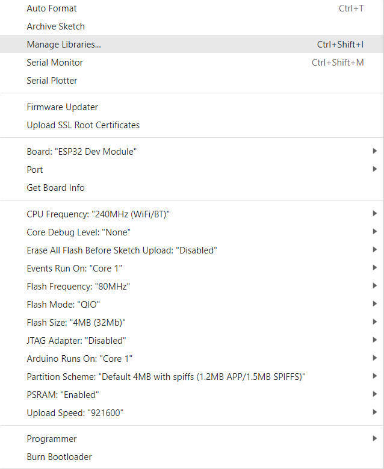

<h1 align = "center">🌟LilyGO T-A76XX🌟</h1>

[](https://github.com/Xinyuan-LilyGO/LilyGO-T-A76XX/actions/workflows/platformio.yml)

# News

- The TinyGSM used in the example is a [fork](https://github.com/lewisxhe/TinyGSM) to support A7670,A7608,SIM7672G,SIM7670G, If you use the master branch, the compilation will not go smoothly
- A7670G/A7670E/A7670SA are collectively referred to as A7670X
- A7672G is exactly the same as A7670G. A7672G is just another name.
- A7608SA-H/A7608E-H,A7608E,A7608SA are collectively referred to as A7608X
- **SIM7672G** and **SIM7670G** are exactly the same, except for the name change , The readme file indicates these two models with **SIM767X**
- **SIM7670G** uses the **Qualcomm** platform, **A7670x** uses the **Asrmicro** platform.
- When using T-Call-A767X, you need to distinguish between versions. Pinmaps for **V1.0** and **V1.1** are different and cannot be used universally.
- The usage methods of A7670/A7670 R2 are exactly the same, but the internal chip manufacturing process of the module is different.
- The difference between A7608X-S3 V1.0 and V1.1 is that V1.1 adds a solar input voltage dividing resistor (occupies IO3), the others are the same
- Differences between T-A7608 and T-A7608-V2:
  1. T-A7608-V2 Remove modem reset pin (IO5)
  2. T-A7608-V2 Remove power on pin (IO12)
  3. Add onboard LED (IO12)
  4. Add solar voltage ADC(IO34) detection function

# 1️⃣Product

| Product(PinMap)         | SOC              | Flash    | PSRAM     | Schematic                                                                                    |
| ----------------------- | ---------------- | -------- | --------- | -------------------------------------------------------------------------------------------- |
| [T-A7670X][1]           | ESP32-WROVER-E   | 4MB      | 8MB(QSPI) | [schematic](./schematic/T-A7670X-V1.1.pdf)                                                   |
| [T-Call-A7670X-V1.0][2] | ESP32-WROVER-E   | 4MB      | 8MB(QSPI) | [schematic](./schematic/T-Call-A7670-V1.0.pdf)                                               |
| [T-A7608][4]            | ESP32-WROVER-E   | 4MB      | 8MB(QSPI) | [schematic](./schematic/T-A7608X-V1.0.pdf)                                                   |
| [T-A7608-V2][8]         | ESP32-WROVER-E   | 4MB      | 8MB(QSPI) | [schematic](./schematic/A7608-ESP32-V2.pdf)                                                  |
| [T-A7608-S3][6]         | ESP32-S3-WROOM-1 | 16MB     | 8MB(OPI)  | [schematic](./schematic/T-A7608-S3-V1.0.pdf)                                                 |
| [T-SIM767XG-S3][7]      | ESP32-S3-WROOM-1 | 16MB     | 8MB(OPI)  | [schematic](./schematic/T-SIM767XG-S3-V1.0.pdf)                                              |
| [T-PCIE-A7670][8]       | ESP32-WROVER-E   | 16MB/4MB | 8MB(QSPI) | [schematic](https://github.com/Xinyuan-LilyGO/LilyGo-T-PCIE/blob/master/schematic/A7670.pdf) |

<!-- | [T-Call-A7670X-V1.1][3] | ESP32-WROVER-E   | 4MB      | 8MB(QSPI) | [schematic](./schematic/T-Call-A7670-V1.1.pdf)                                               | -->
<!-- | [T-A7608-DC-S3][5]      | ESP32-S3-WROOM-1 | 16MB     | 8MB(OPI)  | [schematic](./schematic/T-A7608X-DC-S3-V1.0.pdf)                                             | -->

[1]: https://www.lilygo.cc/products/t-sim-a7670eZ
[2]: https://www.lilygo.cc/products/t-call-v1-4
<!-- [3]: https://www.lilygo.cc/products/t-call-v1-4 -->
[4]: https://www.lilygo.cc/products/t-a7608e-h
<!-- [5]: https://www.lilygo.cc -->
[6]: https://lilygo.cc/products/t-a7608e-h?variant=43932699033781
[7]: https://www.lilygo.cc/products/t-sim-7670g-s3
[8]: https://lilygo.cc/products/a-t-pcie?variant=42335922094261

## 2️⃣Examples

| Example                         | [T-A7670X][1]     | [T-Call-A7670X][2] | [T-SIM767XG-S3][6] | [T-A7608/V2][3] | [T-PCIE-A767X][8] | [T-A7608-S3][5] |
| ------------------------------- | ----------------- | ------------------ | ------------------ | --------------- | ----------------- | --------------- |
| ATdebug                         | ✅                 | ✅                  | ✅                  | ✅               | ✅                 | ✅               |
| Blynk_Console                   | ✅                 | ✅                  | ✅                  | ✅               | ✅                 | ✅               |
| GPSShield                       | ✅ (Only T-A7670G) | ❌   (Can't run)    | ❌   (Can't run)    | ❌   (Can't run) | ❌   (Can't run)   | ❌   (Can't run) |
| GPS_BuiltIn                     | ✅ (Except A7670G) | ✅(Except A7670G)   | ✅                  | ✅               | ✅                 | ✅               |
| GPS_NMEA_Parse                  | ✅ (Except A7670G) | ✅(Except A7670G)   | ✅                  | ✅               | ✅                 | ✅               |
| GPS_NMEA_Output                 | ✅ (Except A7670G) | ✅(Except A7670G)   | ✅                  | ✅               | ✅                 | ✅               |
| GPS_Acceleration                | ✅ (Except A7670G) | ✅(Except A7670G)   | ❌   (Can't run)    | ✅               | ✅                 | ✅               |
| HttpClient                      | ✅                 | ✅                  | ✅                  | ✅               | ✅                 | ✅               |
| HttpsClient                     | ✅                 | ✅                  | ✅                  | ✅               | ✅                 | ✅               |
| MqttClient                      | ✅                 | ✅                  | ✅                  | ✅               | ✅                 | ✅               |
| ReadBattery                     | ✅                 | ❌   (Can't run)    | ✅                  | ✅               | ❌   (Can't run)   | ✅               |
| DeepSleep                       | ✅                 | ✅                  | ✅                  | ✅               | ✅                 | ✅               |
| ModemSleep                      | ✅                 | ✅                  | ✅                  | ✅               | ✅                 | ✅               |
| ModemPowerOff                   | ✅                 | ✅                  | ✅                  | ✅               | ✅                 | ✅               |
| VoiceCalls                      | ✅                 | ✅                  | ❌[5]               | ✅               | ✅                 | ✅               |
| SDCard                          | ✅                 | ❌   (Can't run)    | ✅                  | ✅               | ✅                 | ✅               |
| SerialRS485                     | ✅                 | ✅                  | ✅                  | ✅               | ✅                 | ✅               |
| SendSMS                         | ✅                 | ✅                  | ❌[4]               | ✅               | ✅                 | ✅               |
| ReadSMS                         | ✅                 | ✅                  | ❌[4]               | ✅               | ✅                 | ✅               |
| SendLocationFromSMS             | ✅                 | ✅                  | ❌[4]               | ✅               | ✅                 | ✅               |
| SendLocationFromSMS_Use_TinyGPS | ✅                 | ✅                  | ❌[4]               | ✅               | ✅                 | ✅               |
| LBSExample                      | ✅                 | ✅                  | ❌   (No support)   | ✅               | ✅                 | ✅               |
| Network                         | ✅                 | ✅                  | ✅                  | ✅               | ✅                 | ✅               |
| MqttsBuiltlnAuth                | ✅                 | ✅                  | ✅                  | ✅               | ✅                 | ✅               |
| MqttsBuiltlnSSL                 | ✅                 | ✅                  | ✅                  | ✅               | ✅                 | ✅               |
| MqttsBuiltlnNoSSL               | ✅                 | ✅                  | ✅                  | ✅               | ✅                 | ✅               |
| MqttsBuiltlnAWS                 | ✅                 | ✅                  | ✅                  | ✅               | ✅                 | ✅               |
| MqttsBuiltlnHivemq              | ✅                 | ✅                  | ✅                  | ✅               | ✅                 | ✅               |
| MqttsBuiltlnEMQX                | ✅                 | ✅                  | ✅                  | ✅               | ✅                 | ✅               |
| MqttsBuiltlnWill                | ✅                 | ✅                  | ✅                  | ✅               | ✅                 | ✅               |
| HttpsBuiltlnGet                 | ✅                 | ✅                  | ✅                  | ✅               | ✅                 | ✅               |
| HttpsBuiltlnPost                | ✅                 | ✅                  | ✅                  | ✅               | ✅                 | ✅               |
| HttpsOTAUpgrade                 | ✅                 | ✅                  | ✅                  | ✅               | ✅                 | ✅               |
| HP303BSensor*                   | ✅                 | ✅                  | ✅                  | ✅               | ✅                 | ✅               |
| SPIExample*                     | ✅                 | ✅                  | ✅                  | ✅               | ✅                 | ✅               |
| PowerMonitoring                 | ✅                 | ❌                  | ❌(No support)[2]   | ✅               | ❌                 | ✅               |
| SimHatAccelerometer[3]          | ✅                 | ❌                  | ❌(No support)[2]   | ✅[1]            | ❌                 | ✅               |
| SimHatCurrentSensor[3]          | ✅                 | ❌                  | ❌(No support)[2]   | ✅               | ❌                 | ✅               |
| SimHatOneWireSensor[3]          | ✅                 | ❌                  | ❌(No support)[2]   | ✅               | ❌                 | ✅               |
| SimHatRelay[3]                  | ✅                 | ❌                  | ❌(No support)[2]   | ✅               | ❌                 | ✅               |

- HP303BSensor,SPIExample it only demonstrates how to define and use SPI and I2C. Please confirm the pin connection and IO definition before use.
- [1] T-A7608-ESP32 Conflict with Solar ADC
- [2] The relay driver conflicts with the board RST and cannot work
- [3] Requires external expansion board support [T-SimHat](https://www.lilygo.cc/products/lilygo%C2%AE-t-simhat-can-rs485-relay-5v)
- [4] SIM7670G - `SIM7670G-MNGV 2374B04` version supports SMS function, but it requires the operator base station to support SMS Over SGS service to send, otherwise it will be invalid
- [5] All versions of SIM7670G do not support voice

# Quick start ⚡

## 3️⃣ PlatformIO Quick Start (Recommended)

1. For users using the ESP32 version (non ESP32S3 version), please install the **CH9102 USB bridge** driver for the first time.
   - [Windows](https://www.wch-ic.com/downloads/CH343SER_ZIP.html)
   - [Mac OS](https://www.wch-ic.com/downloads/CH34XSER_MAC_ZIP.html)
2. Install [Visual Studio Code](https://code.visualstudio.com/) and [Python](https://www.python.org/)
3. Search for the `PlatformIO` plugin in the `VisualStudioCode` extension and install it.
4. After the installation is complete, you need to restart `VisualStudioCode`
5. After restarting `VisualStudioCode`, select `File` in the upper left corner of `VisualStudioCode` -> `Open Folder` -> select the `LilyGO-T-A76XX` directory
6. Wait for the installation of third-party dependent libraries to complete
7. Click on the `platformio.ini` file, and in the `platformio` column
8. Select the board name you want to use in `default_envs` and uncomment it.
9. Uncomment one of the lines `src_dir = xxxx` to make sure only one line works
10. Click the (✔) symbol in the lower left corner to compile
11. Connect the board to the computer USB-C , Micro-USB is used for module firmware upgrade
12. Click (→) to upload firmware
13. Click (plug symbol) to monitor serial output
14. If it cannot be written, or the USB device keeps flashing, please check the **FAQ** below

## 4️⃣ Arduino IDE Quick Start

- It is recommended to use platformio without cumbersome steps
  
1. For users using the ESP32 version (non ESP32S3 version), please install the **CH9102 USB bridge** driver for the first time.
   - [Windows](https://www.wch-ic.com/downloads/CH343SER_ZIP.html)
   - [Mac OS](https://www.wch-ic.com/downloads/CH34XSER_MAC_ZIP.html)
2. Install [Arduino IDE](https://www.arduino.cc/en/software)
3. Install [Arduino ESP32 2.0.5 or above](https://docs.espressif.com/projects/arduino-esp32/en/latest/) 
4. Copy all folders in [lib folder](./lib/)  to Arduino library folder (e.g. C:\Users\YourName\Documents\Arduino\libraries)
5. Open ArduinoIDE  ,`Tools` , Look at the picture to choose , **If you use the ESP32-S3 controller and need to use serial, then USB CDC ON Boot needs to be set to Enabled**
    | [T-A7670X][1]/[T-Call-A7670X][2]/[T-A7608][3]/[T-PCIE-A7670][8] | [T-A7608-S3][5]/[T-SIM767XG-S3][6]   |
    | --------------------------------------------------------------- | ------------------------------------ |
    |                                 |  |
6. `LilyGO-T-A76XX` folder -> `examples` -> `Choose the appropriate example from the list above`
7. Open the corresponding board macro definition above [utilities.h](./examples/ATdebug/utilities.h)
8. Connect the board to the computer USB-C , Micro-USB is used for module firmware upgrade
9. Select `Port`
10. Click `upload` , Wait for compilation and writing to complete
11. If it cannot be written, or the USB device keeps flashing, please check the **FAQ** below


### Writing as a beginner

- When opening the Arduino IDE, you will be prompted that there are new libraries that can be updated. Please do not click update. There is no guarantee that it can be compiled, run, etc. after the update. Make sure that the board is running normally before deciding whether to update. You have to Know that problems may occur after updating due to library differences, or the default configuration (such as TinyGSM) will be overwritten.
- If it runs abnormally after the update, please follow Article 4 of the Arduino Quick Start to delete the directory in libraries, and drag the folder in lib into the libraries directory again.

## 5️⃣ Notes for new Users <T-A7670X/T-A7608X>

1. The A7670G does not have a built-in GPS modem, regardless of whether the motherboard contains a GPS connector.

- **The following does not apply to T-Call-A7670**

1. Pin VIN is a USB input, if a battery is being used to power the device there will be no voltage output from VIN meaning 3.3v is the only power output.
2. When using the built-in battery pack the on/off switch will function as normal, supplying/cutting off power to the board, However, if an external battery pack is used and attached to the VBAT pin the on/off switch will be bypassed meaning the only way to shut off will be to disconnect the batteries.
3. On/off switch is for battery use only, it will not function when plugged into USB.
4. Recommended solar panels are 4.4v to 6v **DO NOT EXCEED OR BOARD MAY BE DAMAGED** 
5. When an SD card in you can not upload software in Arduino IDE since the SD card uses IO2 as CS, the SD card must be removed when uploading a new sketch.
6. The `T-A7670G` modem does not contain a GPS positioning component and requires an additional external GPS positioning module to use the positioning function. [LilyGo T-A7670G with GPS](https://www.lilygo.cc/products/t-sim-a7670e?variant=43043706077365) uses [Quectel L76K](https://www.quectel.com/cn/product/gnss-l76k) as the **T-A7670G** auxiliary positioning function, which requires a part of the IO, please refer to the [GPSShield example](./examples/GPSShield/) , How to identify whether you have an external GPS module please see [#issues56](https://github.com/Xinyuan-LilyGO/LilyGO-T-A76XX/issues/56#issuecomment-1672628977)
7. Known issues, ESP32 (V1.2) version of [T-A7670][1], [T-A7608][4], when using battery power supply mode, BOARD_POWERON_PIN (IO12) must be set to high level after esp32 starts, otherwise a reset will occur.

# 6️⃣ FAQ

- **Can't turn on the phone after connecting the battery for the first time?**
   1. This is due to the characteristics of the onboard battery over-discharge and over-charge chip. It cannot be turned on when the battery is connected for the first time. This can be solved by inserting a USB charger or reconnecting the battery. For details, please see the remarks on [page 4](https://www.lcsc.com/datasheet/lcsc_datasheet_2010160933_Shenzhen-Fuman-Elec-DW06D_C82123.pdf) of the datasheet.

- **GPS not working?**
   1. See [issue#137](https://github.com/Xinyuan-LilyGO/LilyGO-T-A76XX/issues/137)
   
- **VOLTE FAQ**
  1. See [issues/115](https://github.com/Xinyuan-LilyGO/LilyGO-T-A76XX/issues/115)

- **Can't upload any sketch，Please enter the upload mode manually.**
   1. Connect the board via the USB cable
   2. Press and hold the BOOT button , While still pressing the BOOT button (If there is no BOOT button, you need to use wires to connect GND and IO0 together.)
   3. Press RST button
   4. Release the RST button
   5. Release the BOOT button (If there is no BOOT button, disconnect IO0 from GND.)
   6. Upload sketch
- **Upgrade modem firmware**
   1. [T-A76XX Upgrade docs](./docs/update_fw.md) / [Video](https://youtu.be/AZkm-Z7mKn8)
   2. [SIM7670G Upgrade issue](https://github.com/Xinyuan-LilyGO/LilyGO-T-A76XX/issues/122) / [Video](https://www.youtube.com/watch?v=fAtrz_4DfVs)
- **How do I connect the antenna correctly?**
   1. Check the silk screen on the board. **GPS** stands for GPS antenna. Only active GPS antenna can be connected here.
   2. **SIM** or **MAIN**, this is the main antenna interface of LTE
   3. **AUX** This is the diversity antenna for LTE, used to enhance the signal
- **Solar input voltage range?**
   1. **4.4 ~ 6V** , As long as the voltage matches, the solar panel power is not limited
- **Where can I access solar energy to charge the panel?**
   1. Some boards(T-A7670,T-A7608,T-A7670-S3,T-A7608-S3) have their own solar battery input interface, you just need to connect the solar panel correctly according to the polarity.
   2. If the board has an external VBAT pin, you can connect the solar rechargeable battery input to VBAT. Please be careful not to exceed the battery supply voltage, which is usually 4.2V.
   3. If there is no VBAT, you can also connect it to the VBUS Pin, which is the input pin for USB power supply. Connecting it to VBUS will share the 5V of the USBC. Please note that when connecting an external charger, disconnect the USBC or disconnect the solar energy. enter
- **How to use voice call example?**
   1. Voice calls require external welding of the condenser microphone and speaker. Generally, the board silk screen is marked SPK. The speaker needs to be welded, and the MIC silk screen position needs to weld the condenser microphone.
- **SIM767XG sendSMS and VoiceCall?**
   1. Although the manual of SIM767XG states that it has the functions of making voice calls and sending text messages, the current firmware does not support it.
- **Unable to detect SIMCard?**
   1. All SIM series need to insert the SIMCard into the board first and then power on to detect the SIM card. If the order is reversed, it will report that the SIMCard cannot be detected.
- **For ESP32S3 users , If you use external power supply instead of USBC, please turn off the CDC option. This is because the board will wait for USB access when it starts.**
   1. For Arduino IDE users, it can be turned off in the options , Please note that turning off USB CDC will turn off Serial redirection to USBC. At this time, you will not see any Serial message output when opening the port from USBC, but output from GPIO43 and GPIO44.

    ```c
    Tools -> USB CDC On Boot -> Disable
    ```

   2. For Platformio users, you can add the following compilation flags in the ini file

    ```c
    build_flags =
        ; Enable UARDUINO_USB_CDC_ON_BOOT will start printing and wait for terminal access during startup
        ; -DARDUINO_USB_CDC_ON_BOOT=1

        ; Enable UARDUINO_USB_CDC_ON_BOOT will turn off printing and will not block when using the battery
        -UARDUINO_USB_CDC_ON_BOOT
    ```
- **How to release the limitations of ESP32-WROVER-E GPIO12?**
  1. Since the ESP32-WROVER-E module is used, the internal flash voltage of the module is 3.3V by default. IO12 controls the startup flash startup voltage. If the external device connected to IO12 defaults to the HIGH level, then the startup will fall into an infinite restart. ,
  Two solutions,
  1. Replace the IO port and connect the default low-level device to IO12
  2. Use espefuse to forcefully set the flash voltage to 3.3V. For details, please refer [here](https://docs.espressif.com/projects/esptool/en/latest/esp32/espefuse/set-flash-voltage-cmd.html#set-flash-voltage), this can only be set once, and cannot be set incorrectly. If the setting is incorrect, the module will never start.

- **Network registration denied?**
   2. When the network registration is refused, please check whether the APN is set correctly. For details, please refer to [issues104](https://github.com/Xinyuan-LilyGO/LilyGO-T-A76XX/issues/104)

- **Can't use 2G(GSM)?**
- LilyGo has launched a separate 4G(LTE) version that can only use 4G(LTE) network. Please check whether it is a separate 4G(LTE) version during ordering.


# 7️⃣Resource

1. SIMCOM official website document center
   - [SIMCOM official A7670X All Datasheet](https://cn.simcom.com/product/A7670X.html)
   - [SIMCOM official A7608X All Datasheet](https://cn.simcom.com/product/A7608X-H-E_SA.html)
   - [SIMCOM official SIM7672 All Datasheet](https://en.simcom.com/product/SIM7672.html)
2. A7670/A7608-Datasheet
   - [A76xx AT Command](./datasheet/A76XX/A76XX_Series_AT_Command_Manual_V1.09.pdf)
   - [A76xx MQTT(S) Application](./datasheet/A76XX/A76XX%20Series_MQTT(S)_Application%20Note_V1.02.pdf)
   - [A76xx HTTP(S) Application](./datasheet/A76XX/A76XX%20Series_HTTP(S)_Application%20Note_V1.02.pdf)
   - [A76xx GNSS Application](./datasheet/A76XX/A76XX%20Series_GNSS_Application%20Note_V1.02.pdf)
   - [A76xx FTP Application](./datasheet/A76XX/A76XX%20Series_FTP(S)_Application%20Note_V1.02.pdf)
   - [A76xx LBS Application](./datasheet/A76XX/A76XX%20Series_LBS_Application%20Note_V1.02.pdf)
   - [A76xx SSL Application](./datasheet/A76XX/A76XX%20Series_SSL_Application%20Note_V1.02.pdf)
   - [A76xx Sleep Application](./datasheet/A76XX/A76XX%20Series_Sleep%20Mode_Application%20Note_V1.02.pdf)
   - [A76xx Hardware Design manual](./datasheet/A76XX/A7670C_R2_硬件设计手册_V1.06.pdf)
   - [A76xx TCPIP Application](./datasheet/A76XX/A76XX%20Series_TCPIP_Application%20Note_V1.02.pdf)
3. SIM767XG-Datasheet
   - [SIM7672 Hardware Design manual](./datasheet/SIM767X/SIM7672X_Series_Hardware_Design_V1.02.pdf)
   - [SIM7672 AT Command](./datasheet/SIM767X/SIM767XX%20Series_AT_Command_Manual_V1.01.pdf)
4. Schematic
   - [T-A7608-S3 Schematic](./schematic/T-A7608-S3-V1.0.pdf)
   - [T-A7608X-DC-S3 Schematic](./schematic/T-A7608X-DC-S3-V1.0.pdf)
   - [T-A7608X Schematic](./schematic/T-A7608X-V1.0.pdf)
   - [T-A7608X-V2 Schematic](./schematic/A7608-ESP32-V2.pdf)
   - [T-A7670X Schematic](./schematic/T-A7670X-V1.1.pdf)
   - [T-Call-A7670 Schematic](./schematic/T-Call-A7670-V1.0.pdf)
   - [T-SIM7672-S3 Schematic](./schematic/T-SIM7672-S3-V1.0.pdf)
5. Dimensions
   - [T-A7608-S3 DWG](./dimensions/T-A7608-S3-V1.0.dwg)
   - [T-A7608X-DC-S3 DWG](./dimensions/T-A7608X-DC-S3-V1.0.dwg)
   - [T-A7608X DWG](./dimensions/T-A7608X-V1.0.dwg)
   - [T-A7670X DWG](./dimensions/T-A7670X-V1.1.dwg)
   - [T-Call-A7670 DWG](./dimensions/T-Call-A7670-V1.0.dwg)
   - [T-SIM7672-S3 DWG](./dimensions/T-SIM7672-S3-V1.0.dwg)


