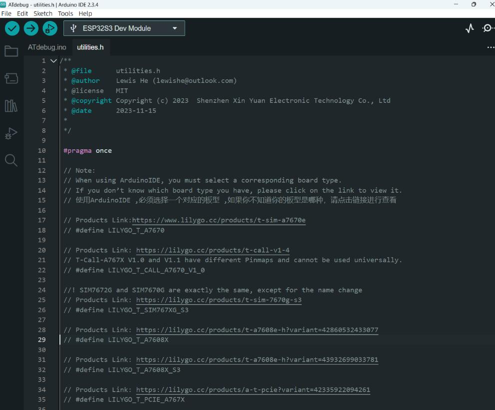

  

<h1 align = "center">🌟LilyGo A7608X ESP32S3 Version🌟</h1>

## Overview

* This page introduces the hardware parameters related to `LilyGo A7608X ESP32S3 Version`

### Product

| Product                  | SOC              | Flash          | PSRAM    |
| ------------------------ | ---------------- | -------------- | -------- |
| [T-A7608E/SA ESP32S3][1] | ESP32-S3-WROOM-1 | 16MB(Quad-SPI) | 8MB(OPI) |

[1]: https://lilygo.cc/products/t-a7608e-h?variant=43932699033781

### PlatformIO Quick Start

1. Install [Visual Studio Code](https://code.visualstudio.com/) and [Python](https://www.python.org/)
2. Search for the `PlatformIO` plugin in the `Visual Studio Code` extension and install it.
3. After the installation is complete, you need to restart `Visual Studio Code`
4. After restarting `Visual Studio Code`, select `File` in the upper left corner of `Visual Studio Code` -> `Open Folder` -> select the `LilyGo-Modem-Series` directory
5. Wait for the installation of third-party dependent libraries to complete
6. Click on the `platformio.ini` file, and in the `platformio` column
7. Cancel the `;` symbol in front of the line `default_envs = T-A7608X-S3` and use `T-A7608X-S3` as the default environment
8. Uncomment one of the lines `src_dir = xxxx` to ensure that only one line is valid. For example, to enable `src_dir = examples/ATdebug`, remove the leading `;` symbol and save the file. The ATDebug example will now be compiled.
9. Click the (✔) symbol in the lower left corner to compile
10. Connect the board to the computer USB-C , Micro-USB is used for module firmware upgrade
11. Click (→) to upload firmware
12. Click (plug symbol) to monitor serial output
13. If it cannot be written, or the USB device keeps flashing, please check the **FAQ** below

### Arduino IDE quick start

1. Install [Arduino IDE](https://www.arduino.cc/en/software)
2. Install [Arduino ESP32](https://docs.espressif.com/projects/arduino-esp32/en/latest/)
3. Copy all folders in the `lib` directory to the `Sketchbook location` directory. How to find the location of your own libraries, [please see here](https://support.arduino.cc/hc/en-us/articles/4415103213714-Find-sketches-libraries-board-cores-and-other-files-on-your-computer)
    * Windows: `C:\Users\{username}\Documents\Arduino`
    * macOS: `/Users/{username}/Documents/Arduino`
    * Linux: `/home/{username}/Arduino`
4. Open the corresponding example
    * Open the downloaded `LilyGo-Modem-Series`
    * Open `examples`
    * Select the sample file and open the file ending with `ino`
5. On Arduino ISelect the corresponding board in the DE tool project and click on the corresponding option in the list below to select

    | Name                                 | Value                               |
    | ------------------------------------ | ----------------------------------- |
    | Board                                | **ESP32S3 Dev Module**              |
    | Port                                 | Your port                           |
    | USB CDC On Boot                      | Enable                              |
    | CPU Frequency                        | 240MHZ(WiFi)                        |
    | Core Debug Level                     | None                                |
    | USB DFU On Boot                      | Disable                             |
    | Erase All Flash Before Sketch Upload | Disable                             |
    | Flash Mode                           | QIO 80Mhz                           |
    | Flash Size                           | **16MB(128Mb)**                     |
    | Arduino Runs On                      | Core1                               |
    | USB Firmware MSC On Boot             | Disable                             |
    | Partition Scheme                     | **16M Flash (3MB APP/9.9MB FATFS)** |
    | PSRAM                                | **OPI PSRAM**                       |
    | Upload Speed                         | 921600                              |
    | Programmer                           | **Esptool**                         |

     * `Partition Scheme` Please select according to the actual application. For example, select **16M Flash (3MB APP/9.9MB FATFS)** , For more partitioning schemes, please see [here](https://docs.espressif.com/projects/esp-idf/en/stable/esp32/api-guides/partition-tables.html)

6. In the open sketch, select the `utilities.h` file and uncomment the line `// #define LILYGO_T_A7608X_S3`. Delete the `//` and save the file to use this board as the default configuration.

   

7. Upload sketch

> \[!IMPORTANT]
>
> 1. Unable to upload any code? Please see the FAQ below
> 2. When opening the Arduino IDE, you will be prompted that there are new libraries that can be updated. Please do not click update. There is no guarantee that it can be compiled, run, etc. after the update. Make sure that the board is running normally before deciding whether to update. You have to Know that problems may occur after updating due to library differences, or the default configuration (such as TinyGSM) will be overwritten.
> 3. If it runs abnormally after the update, please follow Article 4 of the Arduino Quick Start to delete the directory in libraries, and drag the folder in lib into the libraries directory again.

### 📍 Pins Map

| Name            | GPIO NUM     | Free |
| --------------- | ------------ | ---- |
| Modem TX        | 17           | ❌    |
| Modem RX        | 18           | ❌    |
| Modem PWRKEY    | 15           | ❌    |
| Modem RESET     | 16           | ❌    |
| Modem RING      | 6            | ❌    |
| Modem DTR       | 7            | ❌    |
| Battery ADC Pin | 4            | ❌    |
| Solar ADC Pin   | 3            | ❌    |
| SD SCK          | 21           | ❌    |
| SD MISO         | 47           | ❌    |
| SD MOSI         | 14           | ❌    |
| SD CS           | 13           | ❌    |
| GPS Enabled     | Modem AUXVDD | ❌    |

### ⚡ Electrical parameters

| Features                        | Details |
| ------------------------------- | ------- |
| 🔗USB-C Input Voltage            | 5V      |
| ⚡Solar Input Voltage            | 5~6V    |
| ⚡USB-C/Solar Charge Max Current | 500mA   |
| 🔋Battery Voltage                | 3.7V    |

> \[!TIP]
>
> 1. The onboard JST2.0 interface is only used to connect the solar panel to charge the battery, and cannot provide power to the board from this interface
> 2. It is recommended to use a solar panel with an output voltage of 6V or 5V and a power of about 5-10W. Solar energy can only charge the battery. Without the battery, the panel cannot supply power.
> Please note that this is only a suggestion. It is not necessary to use a 5-10W solar panel. 1W is also acceptable.
> The size of the solar panel determines the current and speed of solar charging. Please note that depending on the environment,
> the sunshine time may not exceed one hour per day. At this time, if the solar panel is too small and the light is not sufficient, it cannot be charged.

### Button Description

| Button                   | Function                            |
| ------------------------ | ----------------------------------- |
| BOOT(Close to esp)       | Customizable function/Download mode |
| RST                      | Reset devices button                |
| USB-BOOT(Close to modem) | Modem Upgrade mode                  |

* Press and hold the `BOOT` button before powering on. The board is now in waiting mode for downloading.
* Before powering on, keep the `USB-BOOT` button pressed to put the modem into firmware update mode.
* The above naming method is subject to the board silk screen printing

### Antenna Description

|      | Function                     |
| ---- | ---------------------------- |
| SIM  | LTE Main antenna interface   |
| AUX  | LTE Tiered antenna interface |
| GNSS | GPS active antenna interface |

* When using, you only need to connect the LTE antenna you wear to the SIM IPEX first generation interface. The AUX antenna does not need to be connected.
* The above naming method is subject to the board silk screen printing

### LED Description

| FUNCTION            | COLOR                           |
| ------------------- | ------------------------------- |
| MODEM STATUS        | RED   (Near the modem)          |
| MODEM NETWORK STATE | RED   (Near the modem)          |
| CHARGE LED          | BLUE  (Near the battery switch) |
| CHARGE DONE LED     | BLUE  (Near the battery switch) |

* Modem Status light and network status led cannot be turned off

### Resource

* [GPS Antenna](../../../../datasheet/GPS%20Antenna%20Specifications.pdf)
* [LTE Antenna](../../../../datasheet/LTE%20Antenna%20Specifications.pdf)
* [T-A7608X Schematic](../../../../schematic/esp32/T-A7608X-V1.0.pdf)
* [SIMCOM official A7608X All Datasheet](https://cn.simcom.com/product/A7608X-H-E_SA.html)
* [For A7608 series documentation, please visit the datasheet directory.](../../../../datasheet/A76XX/)
* [Board dimensions](../../../../dimensions/esp32s3/T-A7608-S3.dxf)

### FAQ

* **Upgrade modem firmware**
  1. [T-A76XX Upgrade docs](../../../../docs/update_fw.md) / [Video](https://youtu.be/AZkm-Z7mKn8)

* **Unable to detect SIMCard?**
   1. Need to insert the SIMCard into the board first and then power on to detect the SIM card. If the order is reversed, it will report that the SIMCard cannot be detected.

* **Can't upload any sketch，Please enter the upload mode manually.**
   1. Connect the board via the USB cable
   2. Press and hold the **BOOT** button , While still pressing the **BOOT** button
   3. Press **RST** button
   4. Release the **RST** button
   5. Release the **BOOT** button
   6. Upload sketch

* **What the onboard switch does**
  1. When using the internal battery pack, the switch will work normally to power/power down the board. However, if an external battery pack is used and connected to the VBAT pin, the switch will be bypassed, meaning the only way to shut down is to disconnect the battery.
  2. The switch is only for battery power and has no effect when plugged into USB

* **About VBUS Pin**
  1. VBUS Pin and USB-C are on the same line. Only when USB-C is connected, VBUS has voltage
  2. When only the battery is connected, VBUS has no voltage output
  3. If you want to connect an external power supply without connecting USB-C, VBUS Pin is the only voltage input pin. Please note that the maximum input of VBUS Pin is 5V, do not exceed 5V
