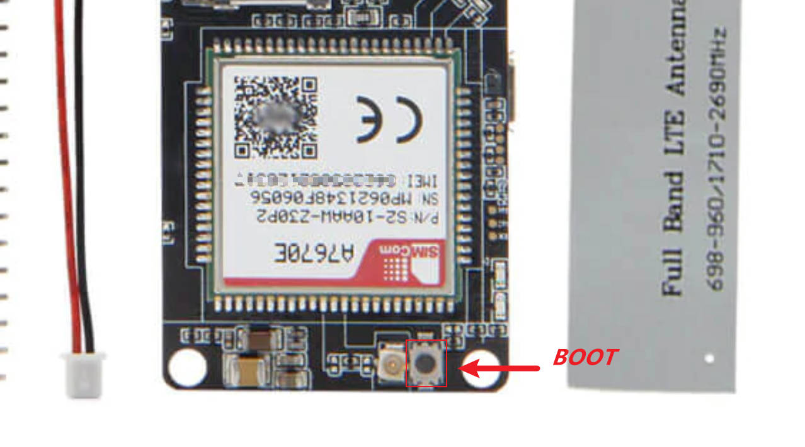
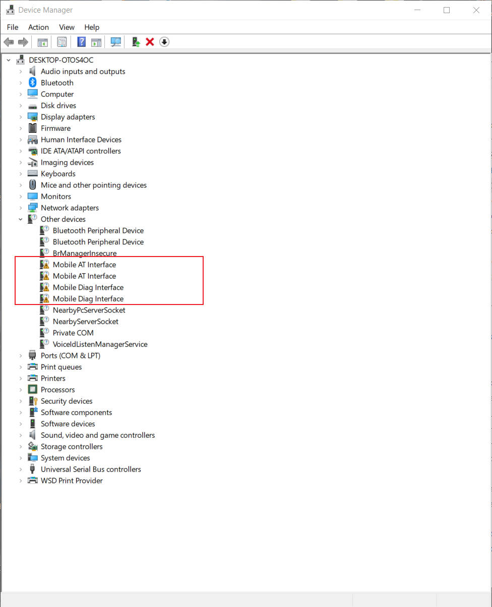
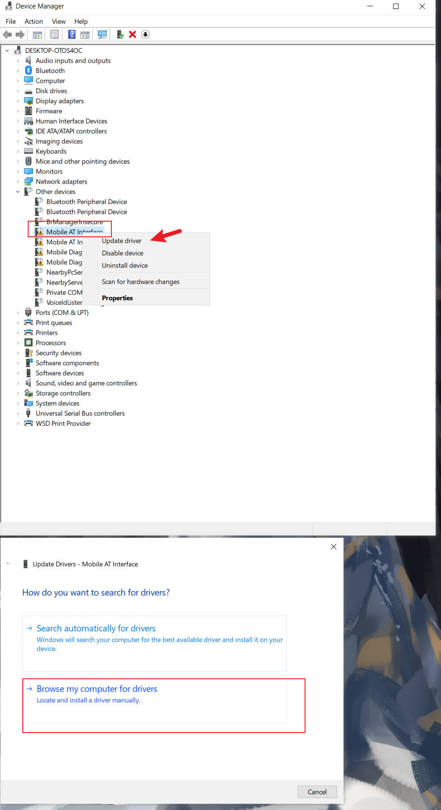
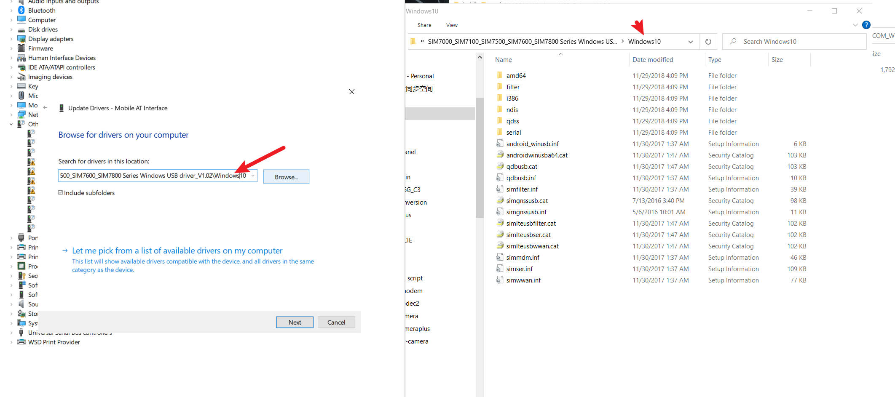
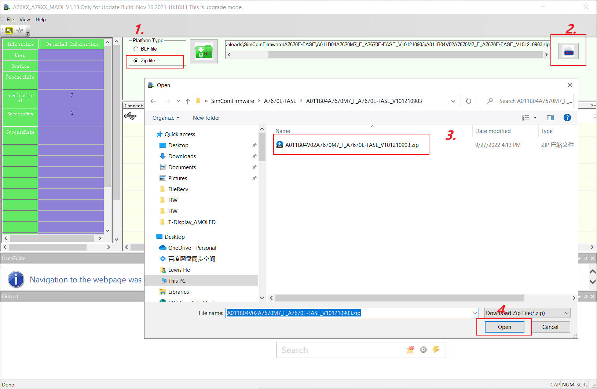

<h1 align = "center">🌟Modem Firmware Update Guide🌟</h1>

####  Download Driver & Tools

[Windows USB Drivers](https://1drv.ms/u/s!AmbpOqVezk5dsjGxh9vgb5wTUugU?e=U7Apiw)
[UpgrageFwTools](https://1drv.ms/u/s!AmbpOqVezk5dsjApvynwP7E-l6BG?e=ELoUXN)

!!! ** Before upgrading, please send `AT+SIMCOMATI` to check the hardware version, Modem will brick if wrong version firmware is written

**Please provide the information in the QR code on the modem to LilyGo to confirm the firmware version.**

### Firmware Update Procedure

1. Upload [ATDebug_sketch](../examples/ATdebug/ATdebug.ino)
2. Press and hold the button next to the modem, then plug in the MicroUSB port
   
   
3. Open the device manager of the computer, and then follow the instructions below to install all unknown drivers

   
   
   
   

    Repeat the above operations to complete the installation of all other device drivers

4. Open `A76XX_A79XX_MADL V1.13 Only for Update.exe`
5. Choose to upgrade the firmware according to the steps in the figure below
   
6. Click GO Button , Wait for the progress bar to complete.
   

7. After the firmware is updated, you can send `AT+SIMCOMATI` to check the version
