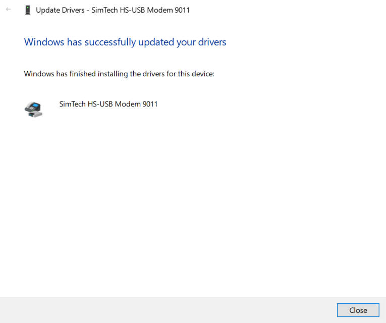
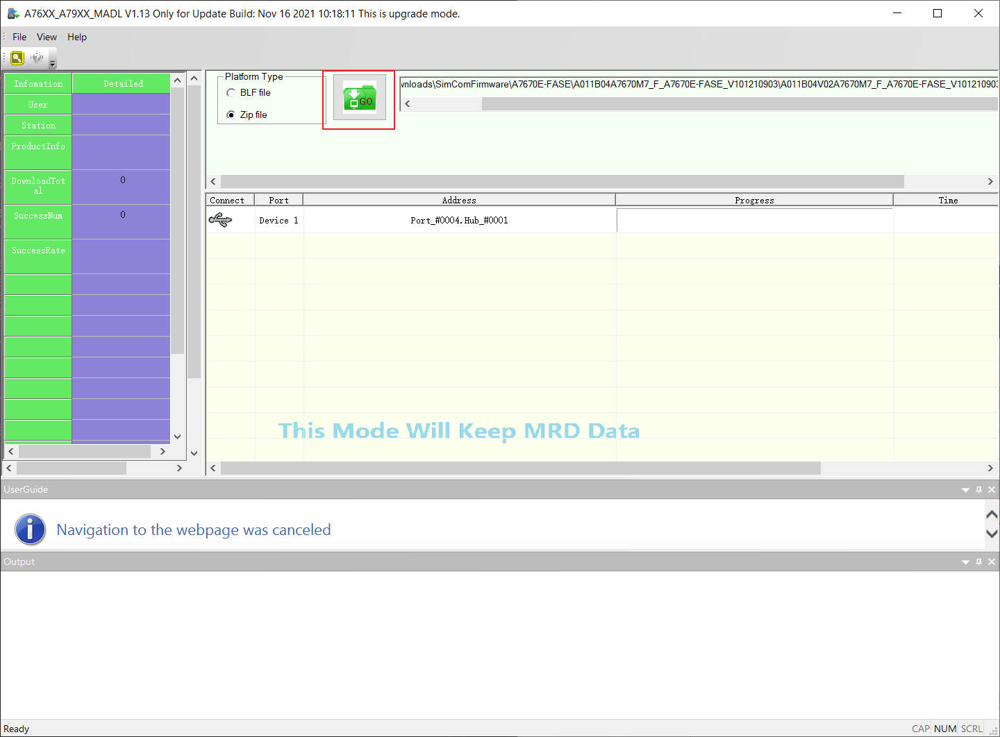

<h1 align = "center">🌟Modem Firmware Update Guide🌟</h1>

# Prerequisites

## Driver

* [Windows USB Drivers](https://drive.google.com/drive/folders/1-7x2z00a5VO7GZS96C6mDupNTBXIh--H?usp=sharing)

## FlashTools

* [A7670X//A7608X Flash Tools](https://drive.google.com/drive/folders/1-g62XMu5g_O6CzTG5M1eAE5d3Q_mhWlV?usp=sharing)
* [SIM7670G Flash Tools](https://drive.google.com/file/d/1-CHQOXQhCJRr1S8rP_AGHVWGqE823wem/view?usp=sharing)

## Firmware

### A7670G

* [A7670G B18](https://drive.google.com/file/d/10BxF-O2aPQ9vB5N97VT3bxPguURNoMvF/view?usp=sharing)

------------------------

### A7670E-LASE No GPS

<!-- * [A7670E-LASE B14](https://drive.google.com/file/d/1ERblToPH4FoAo2dVYn3B--u_FzhIzeMQ/view?usp=sharing) Known HTTP 715 Errors Don't use this version-->
* [A7670E-LASE A124B01](https://drive.google.com/file/d/1-14KABQxVgjcJjJVuofp1BkZd0VYZVWA/view?usp=sharing)<!-- 20241008 Update Fixed  HTTP 715 error-->

------------------------

### A7670E-FASE GPS

<!-- A011B07V01A7670M7_F_A7670E-FASE_CD_V101230711 -->
* [A7670E-FASE B07](https://drive.google.com/file/d/1-5A9w4MCXNz6F5ODhynne0rC9IUOeOdH/view?usp=sharing)<!-- 20241008 Update Fixed  HTTP 715 error-->

------------------------

### A7670SA-FASE GPS

<!-- A011B07V01A7670M7_F_A7670SA-FASE_CD_V101230712 -->
* [A7670SA-FASE-CD](https://drive.google.com/file/d/1-CcYlyPOYpIpcmSDjnfIXDE-GuazzLjO/view?usp=sharing) <!-- 20241009 Update Fixed  HTTP 715 error-->

------------------------

### A7670SA-LASE No GPS

* [A7670SA-LASE B19](https://drive.google.com/file/d/1-evoE-qTLzQEG3OrGdrq9SVuDxEVGHeQ/view?usp=sharing)

------------------------

### SIM7670G

<!-- * ~~[SIM7670G B02](https://drive.google.com/file/d/1-63xiw4TbGwHi3rQDzJpPKwp2SDNPXC1/view?usp=sharing) Known HTTP 715 Errors Don't use this version~~  -->
* [SIM7670G B03](https://drive.google.com/file/d/1bBrze2eDtrjEuJ_2yiufSo87eIk_mYkE/view?usp=sharing) <!-- 20241008 Update Fixed  HTTP 715 error-->

------------------------

### A7608E-H

* [A7608E-H B11](https://drive.google.com/file/d/1IfNkPfQmfG3oqbXEZl0YD_9qgLsN4e_D/view?usp=sharing)

------------------------

### A7608SA-H

* [A7608SA-H B11](https://drive.google.com/file/d/1ktLzCjnd0TXzbiythU1EaWVkAokXzkf9/view?usp=sharing)
* [A7608SA-H A50C4B13](https://drive.google.com/file/d/1-LsgDug-Zz_0kU96HlCGtfks3ruvjcQb/view?usp=sharing)

------------------------

!!! ** Before upgrading, please send `AT+SIMCOMATI` to check the hardware version, Modem will brick if wrong version firmware is written

**Please provide the information in the QR code on the modem to LilyGo to confirm the firmware version.**

### Record Video 

* [SIM7670G Upgrade Record](https://www.youtube.com/watch?v=fAtrz_4DfVs)
* [A7670XX Upgrade Record](https://youtu.be/AZkm-Z7mKn8)

### Firmware Update Procedure

1. Upload [ATDebug_sketch](../examples/ATdebug/ATdebug.ino)
2. Press and hold the button next to the modem, then plug in the MicroUSB port
   
   
3. Open the device manager of the computer, and then follow the instructions below to install all unknown drivers

   
   
   
   

    Repeat the above operations to complete the installation of all other device drivers

4. Open `A76XX_A79XX_MADL V1.13 Only for Update.exe`
5. Choose to upgrade the firmware according to the steps in the figure below
   
6. Click GO Button , Wait for the progress bar to complete.
   

7. After the firmware is updated, you can send `AT+SIMCOMATI` to check the version
