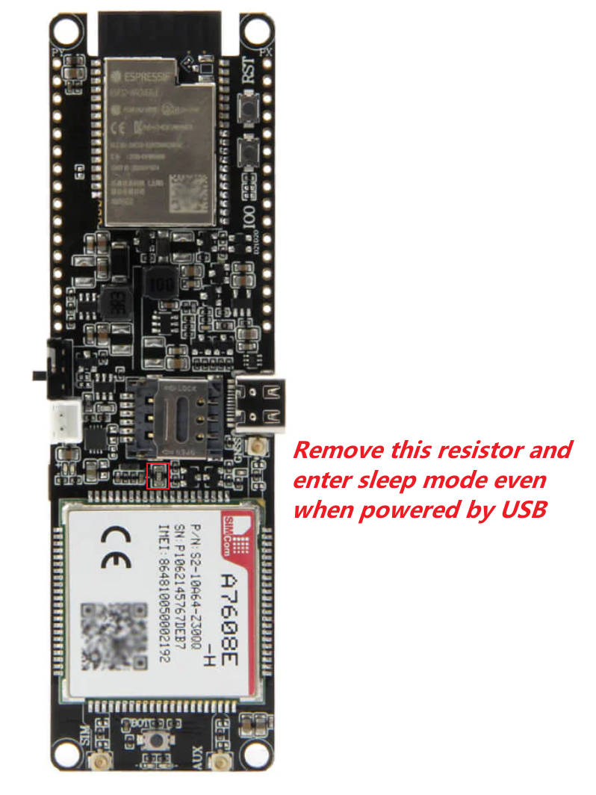
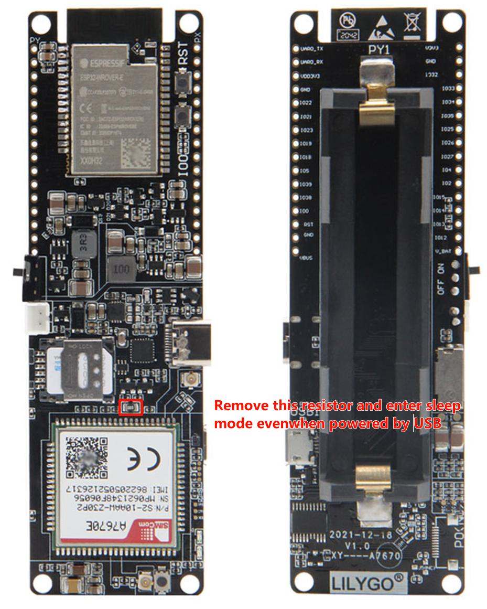

- T-A7608 & T-A7608-S3 & A7670X VBUS of the modem is connected to VUSB.  When using USB power supply, the modem cannot be set to sleep mode. 
- Remove the resistor at the location shown below, and you can enter sleep mode even when powered by USB.
- [Video record](https://youtu.be/2cjNsYcU6TU)

