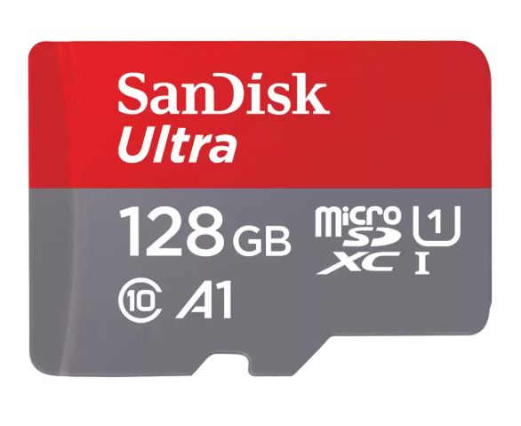

# All tests used the same SD card. Brand: SanDisk 128GB Ultra



## T-A7670X-S3-Standard

```bash
« ESP-ROM:esp32s3-20210327
Build:Mar 27 2021
rst:0x15 (USB_UART_CHIP_RESET),boot:0x39 (SPI_FAST_FLASH_BOOT)
Saved PC:0x4202c9b6
SPIWP:0xee
mode:DIO, clock div:1
load:0x3fce3808,len:0x4bc
load:0x403c9700,len:0xbd8
load:0x403cc700,len:0x2a0c
entry 0x403c98d0
SD Card Type: SDHC
SD Card Size: 121942MB
Starting write speed test...
Write time: 2.58 s
Write speed: 397.21 KB/s
Write block use 2.58 s
Write Speed is 397.21 KB/s
Starting read speed test...
Read time: 2.52 s
Read speed: 406.35 KB/s
Read block use 2.52 s
Read Speed is 406.35 KB/s
```

## T-SIM7670G-S3-Standard

```bash
« ESP-ROM:esp32s3-20210327
Build:Mar 27 2021
rst:0x15 (USB_UART_CHIP_RESET),boot:0x29 (SPI_FAST_FLASH_BOOT)
Saved PC:0x4202c9b6
SPIWP:0xee
mode:DIO, clock div:1
load:0x3fce3808,len:0x4bc
load:0x403c9700,len:0xbd8
load:0x403cc700,len:0x2a0c
entry 0x403c98d0
SD Card Type: SDHC
SD Card Size: 121942MB
Starting write speed test...
Write time: 2.62 s
Write speed: 390.84 KB/s
Write block use 2.62 s
Write Speed is 390.84 KB/s
Starting read speed test...
Read time: 2.51 s
Read speed: 407.32 KB/s
Read block use 2.51 s
Read Speed is 407.32 KB/s
```

## T-SIM7080G-S3-Standard

```bash
« ESP-ROM:esp32s3-20210327
Build:Mar 27 2021
rst:0x15 (USB_UART_CHIP_RESET),boot:0x29 (SPI_FAST_FLASH_BOOT)
Saved PC:0x4202c9b6
SPIWP:0xee
mode:DIO, clock div:1
load:0x3fce3808,len:0x4bc
load:0x403c9700,len:0xbd8
load:0x403cc700,len:0x2a0c
entry 0x403c98d0
SD Card Type: SDHC
SD Card Size: 121942MB
Starting write speed test...
Write time: 2.59 s
Write speed: 395.98 KB/s
Write block use 2.59 s
Write Speed is 395.98 KB/s
Starting read speed test...
Read time: 2.52 s
Read speed: 407.16 KB/s
Read block use 2.52 s
Read Speed is 407.16 KB/s
```

## T-SIM7000G-S3-Standard

```bash
« ESP-ROM:esp32s3-20210327
Build:Mar 27 2021
rst:0x15 (USB_UART_CHIP_RESET),boot:0x2b (SPI_FAST_FLASH_BOOT)
Saved PC:0x4202c9b6
SPIWP:0xee
mode:DIO, clock div:1
load:0x3fce3808,len:0x4bc
load:0x403c9700,len:0xbd8
load:0x403cc700,len:0x2a0c
entry 0x403c98d0
SD Card Type: SDHC
SD Card Size: 121942MB
Starting write speed test...
Write time: 2.59 s
Write speed: 395.52 KB/s
Write block use 2.59 s
Write Speed is 395.52 KB/s
Starting read speed test...
Read time: 2.52 s
Read speed: 407.16 KB/s
Read block use 2.52 s
Read Speed is 407.16 KB/s

```
