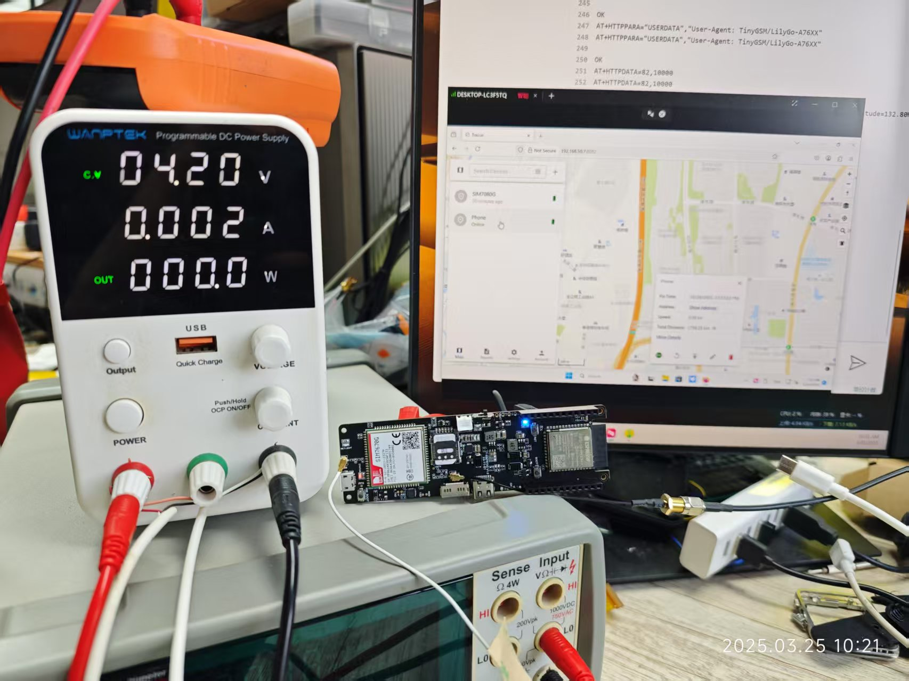
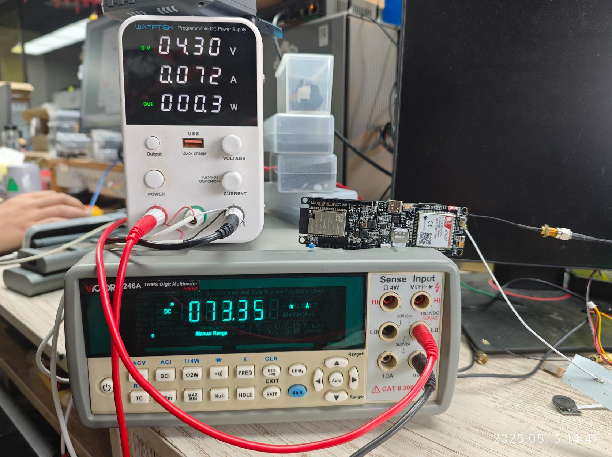

# SIM7670G Light sleep power consumption

- The demo uses SIM7670G as a test sample. When the device starts, the instantaneous current consumption is about 200mA+. The ESP only acts as MCU control, and the WiFi and BLE functions are not turned on.

- When the device is successfully located, after waiting for the location to be sent, the average current consumption is the smallest, about 2~3mA. In the next cycle, the modem will be awakened, and the instantaneous current will rise to 120mA+. Since the modem is not turned off, the subsequent positioning speed is very fast, and it takes about a few seconds to continue to obtain the location, and the cycle is repeated.

- This demo uploads the location obtained by the device to [traccar](https://www.traccar.org/). For more information about [traccar](https://www.traccar.org/), please visit the official website. This demo only demonstrates uploading the location.

## A7670X Light sleep power consumption 20250513

